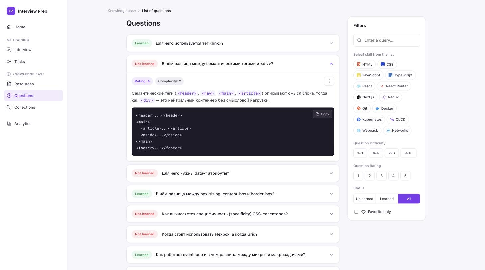
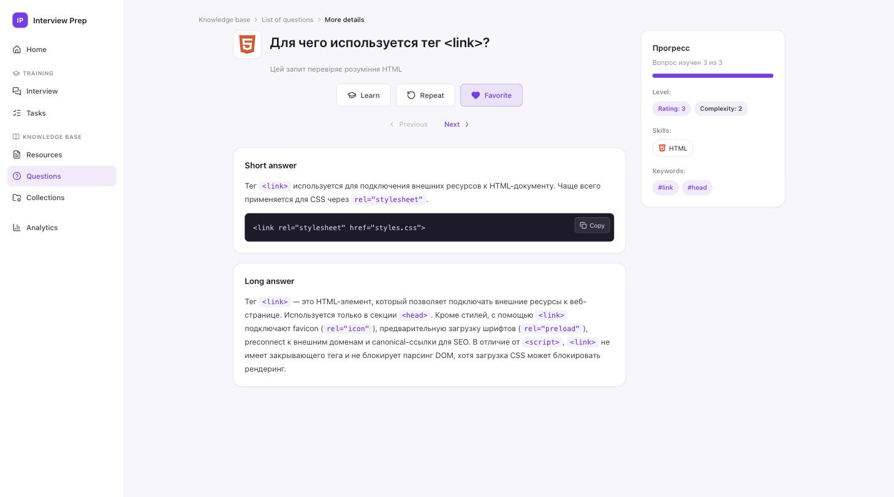
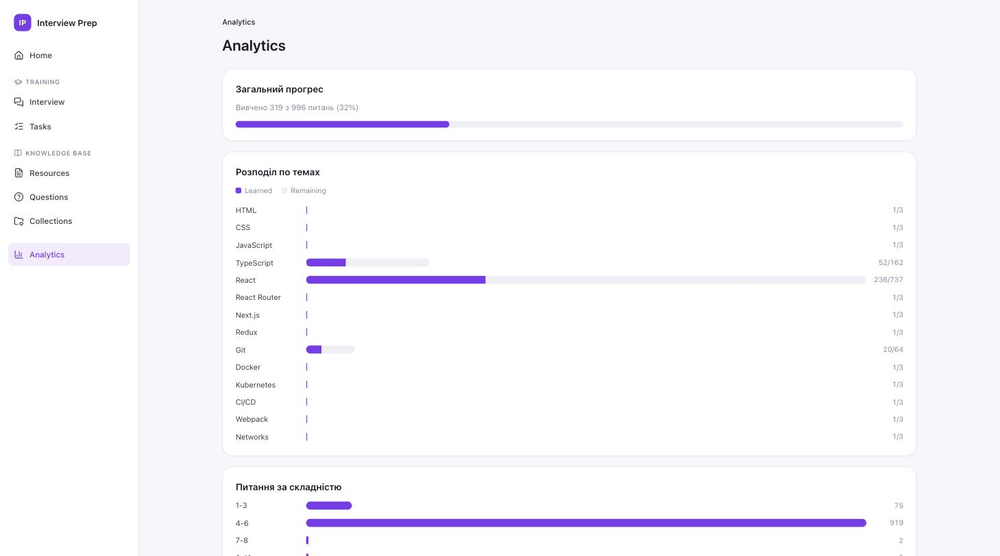

# Interview Prep

A client-only React single-page app for studying technical-interview questions.
Browse a bank of close to 3,000 questions, filter by skill / difficulty / rating,
expand short and long answers with runnable code samples, track how well you know
each question, star favorites, and run a quick flash-card interview simulation.

Everything runs in the browser. All progress is stored in `localStorage` — there
is no backend, no build step for content, and no account.



## Features

- **Question bank** (`/knowledge-base/questions`) — collapsible cards showing a
  learned/not-learned badge, and, when expanded, rating, complexity, the short
  answer, and an optional copy-to-clipboard code block.
- **Filtering** — full-text query over question text and keywords, multi-select
  skill tags, difficulty buckets (`1-3`, `4-6`, `7-8`, `9-10`), rating chips,
  learned / not-learned status, and a "favorites only" toggle. The filter state
  is persisted between visits.
- **Question details** (`/knowledge-base/questions/:id`) — full long answer, a
  progress sidebar, clickable keyword tags that jump back to a filtered list, and
  Previous / Next navigation that follows whatever filter was active on the list.
- **Learn / Repeat / Favorite** — `Learn` bumps a per-question counter toward its
  goal; once the counter reaches the goal the question counts as *Learned*.
  `Repeat` resets the counter. `Favorite` toggles a star.
- **Interview simulation** (`/training/interview`) — a random question, reveal the
  answer, mark it known or not known (which drive `Learn` / `Repeat`), shuffle on.
- **Collections** (`/knowledge-base/collections`) — every question you've starred.
- **Analytics** (`/analytics`) — overall learned percentage, a per-skill
  learned-vs-remaining bar chart, and a question-count-by-difficulty chart.
- **Home** (`/`) — totals for questions, learned, favorites, and skills covered,
  plus quick links into the main sections.

`Tasks` and `Resources` are placeholder pages.

## Screenshots

**Question details** — short answer, long answer, code block, and the progress sidebar:



**Analytics** — overall progress plus a per-skill breakdown:



## Tech stack

| Purpose      | Choice                                                            |
| ------------ | ---------------------------------------------------------------- |
| UI           | React 19                                                         |
| Build / dev  | Vite 8 (`@vitejs/plugin-react`)                                  |
| Routing      | `react-router-dom` 7 (`BrowserRouter`)                          |
| Icons        | `react-icons` (Simple Icons) + `lucide-react`                   |
| Linting      | Oxlint (`react` + `oxc` plugins)                                |
| Styling      | One hand-written global stylesheet (`src/index.css`), no CSS framework |

No TypeScript, no test runner, and no state-management library — runtime state
lives in a single React context.

## Getting started

Requires Node.js **20.19+** or **22.12+** (Vite 8).

```bash
npm install
npm run dev        # start the dev server with HMR — http://localhost:5173
```

### Scripts

| Script            | Description                                                      |
| ----------------- | -------------------------------------------------------------- |
| `npm run dev`     | Vite dev server with hot module replacement                     |
| `npm run build`   | Production build to `dist/` (also the quickest compile check)   |
| `npm run preview` | Serve the production build locally                              |
| `npm run lint`    | Run Oxlint (config: `.oxlintrc.json`)                           |

## Architecture

### Static content vs. persisted progress

The central design constraint: **question content and user progress are stored
separately**, so editing the question bank never wipes learning progress and
vice-versa.

- **`src/data/questions.js`** — the static bank. Exports `SKILLS` (the 14 fixed
  skill tags) and `questions`, built from an internal `rawQuestions` list via
  `createQuestion()`. **IDs are the array position (`index + 1`)**, never stored
  in the data — a random id generated at module load would change on every
  refresh and orphan saved progress. The trade-off: reordering or deleting
  existing entries shifts ids and disconnects their progress. **Appending new
  entries at the end is always safe.**
- **`src/utils/storage.js`** — thin `localStorage` wrappers for two independent
  keys: per-question progress (`status` / `favorite` / `learnedCount` /
  `learnedGoal`) and the last-used filter state.
- **`src/context/QuestionsContext.jsx`** (`QuestionsProvider` / `useQuestions()`)
  — the runtime source of truth. It merges the static `questions` array with
  saved progress and **derives `status` from `learnedCount >= learnedGoal`**
  rather than trusting a stored field, so the *Learned* badge can't drift out of
  sync with the count. It also owns filter state (`DEFAULT_FILTERS`, `setFilters`,
  `resetFilters`).

### Shared behavior hooks

- **`src/hooks/useQuestionActions.js`** is the single implementation of
  `learn` / `repeat` / `toggleFavorite` / `canRepeat`. Both the list-view
  dropdown (`QuestionCardMenu`) and the details-page bar (`QuestionActionsBar`)
  call into it, so the two surfaces can't diverge.
- **`src/hooks/useFilteredQuestions.js`** derives the visible list from the
  context's `questions` + `filters`. Its pure `filterQuestions(questions, filters)`
  export is reused by the details page to compute Previous / Next order
  consistent with the active list filter.

### Icons

`src/utils/skillIcons.jsx` centralizes the skill → icon / color mapping (brand
icons from `react-icons/si`, `lucide-react` fallbacks for CI/CD and Networks).
Use `SKILL_META` / `<SkillIcon skill=… />` instead of importing icons elsewhere.

## Project structure

```
screenshots/                 # images used by this README
public/                      # favicon + static assets
src/
├── main.jsx                 # React entry point
├── App.jsx                  # QuestionsProvider + BrowserRouter + routes
├── index.css                # single global stylesheet
├── data/
│   └── questions.js         # static question bank (SKILLS + questions)
├── context/
│   └── QuestionsContext.jsx # runtime source of truth: merges data + progress, owns filters
├── hooks/
│   ├── useQuestionActions.js   # Learn / Repeat / Favorite logic (used by every surface)
│   └── useFilteredQuestions.js # derives the visible list; exports pure filterQuestions()
├── utils/
│   ├── storage.js           # localStorage read/write wrappers
│   └── skillIcons.jsx       # skill → icon + color mapping (SKILL_META / <SkillIcon />)
├── pages/
│   ├── HomePage.jsx
│   ├── QuestionListPage.jsx
│   ├── QuestionDetailsPage.jsx
│   ├── InterviewPage.jsx
│   ├── AnalyticsPage.jsx
│   ├── CollectionsPage.jsx
│   ├── TasksPage.jsx        # placeholder
│   └── ResourcesPage.jsx    # placeholder
└── components/
    ├── Sidebar.jsx          # persistent nav
    ├── Breadcrumbs.jsx
    ├── FilterSidebar.jsx
    ├── QuestionCard.jsx
    ├── QuestionCardMenu.jsx
    ├── QuestionActionsBar.jsx
    ├── ProgressSidebar.jsx
    ├── FormattedText.jsx    # renders `backtick` spans as inline <code>
    └── CodeBlock.jsx        # <pre> block with copy-to-clipboard
```

### Routes

| Path                            | Page                    |
| ------------------------------- | ----------------------- |
| `/`                             | Home                    |
| `/training/interview`           | Interview simulation    |
| `/training/tasks`               | Tasks (placeholder)     |
| `/knowledge-base/resources`     | Resources (placeholder) |
| `/knowledge-base/questions`     | Question list           |
| `/knowledge-base/questions/:id` | Question details        |
| `/knowledge-base/collections`   | Favorites               |
| `/analytics`                    | Analytics               |
| `*`                             | redirect to `/`         |

## The question bank

`SKILLS` (fixed list):

```
HTML · CSS · JavaScript · TypeScript · React · React Router · Next.js ·
Redux · Git · Docker · Kubernetes · CI/CD · Webpack · Networks
```

### Adding a question

Append an object to `rawQuestions` in `src/data/questions.js`:

```js
{
  question: "Question text",
  shortAnswer: "Short answer. Mark inline code with backticks: `<tag>`.",
  longAnswer: "Full, detailed answer. Blank lines separate paragraphs.",
  codeExample: `console.log("optional — delete this field if not needed")`,
  skills: ["React"],            // one or more names from SKILLS
  keywords: ["#hooks", "#useEffect"],
  difficulty: 4,                // 1–10
  rating: 3,                    // 1–5 (importance)
}
```

- **Do not** set `id` — it is derived from array position.
- **Do not** set progress fields (`status`, `favorite`, `learnedCount`,
  `learnedGoal`); `createQuestion()` fills defaults (`learnedGoal: 3`) and real
  values live in `localStorage`.
- Inline code in `shortAnswer` / `longAnswer` uses `` `backticks` ``
  (`FormattedText` turns those into `<code>`); `codeExample` renders as a
  `CodeBlock` with a copy button.

## Built with Claude Code

This project — application code, question bank, and this README — was created
entirely with [Claude Code](https://claude.com/claude-code).

## License

No license file is included; all rights reserved by the author unless stated
otherwise.
